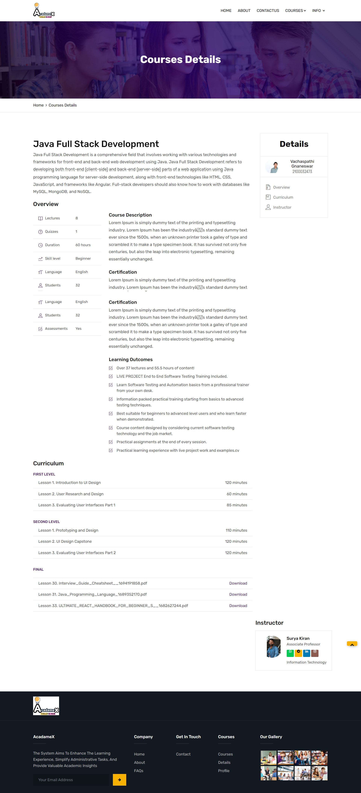

<h1 align="center" id="title">Online Course Management System</h1>

  

Our platform Student Course Management System simplifies the learning experience by combining course engagement performance evaluation and progress monitoring. This platform promotes student involvement by providing easy-to-use navigation a centralized resource hub and interactive communication tools. The system's adaptability enhances administrative efficiency and elevates the learning experience in various educational contexts.

<h2>🚀 Demo</h2>

[https://tinyurl.com/AcadameX](https://tinyurl.com/AcadameX)

<h2>Project Screenshots:</h2>

## Output Screenshots

<h2>🧐 Features</h2>

Here're some of the project's best features:

*   Admin Module: Admins can efficiently manage students and faculty within their departments. Add edit and delete students and faculty members. Assign faculty to specific courses and oversee student enrollment in these courses. View the daily performance of students for effective monitoring.
*   Faculty Module: Faculty members added by department administrators can access the platform securely. Assigned to specific courses faculty can view the total number of registered students. Set tasks and metrics for student completion monitor grades and track overall performance.
*   Student Module: Department administrators add students to their respective departments ensuring secure access. Students can register for courses once per semester viewing only those registered in the previous semester. Complete tasks assigned by mentors participate in quizzes and regularly update assignments for evaluation.

### System Requirements

- Java Development Kit (JDK) 8 or later
- MySQL database
- Apache Maven

### Installation Steps

1. Clone the repository: `git clone https://github.com/your-repo-url.git`
2. Navigate to the project directory: `cd student-course-management-system`
3. Configure the database settings in `application.properties`.
4. Build the project using Maven: `mvn clean install`
5. Run the application: `java -jar target/student-course-management-system.jar`

  
<h2>💻 Built with</h2>

Technologies used in the project:

*   Front-End: HTML + CSS + JS & (Bootstrap) \[Can use React JS/Angular JS\]
*   Middleware: Spring Boot
*   Database: MYSQL \[Can use PostgreSQL\]
*   Database Connectivity: Spring Data JPA
*   Architecture: Microservices
*   Restful Web Services \[Rest API\]

### Usage

1. Access the Admin Module by navigating to `/admin` in your web browser.
2. Use admin credentials to log in and manage students, faculty, and courses.
3. Access the Faculty Module at `/faculty` and log in with faculty credentials.
4. Monitor assigned courses, set tasks for students, and track their performance.
5. Students can log in at `/student` using their credentials.
6. Register for courses, complete assigned tasks, and participate in quizzes.

### Contributors

- [Vachaspathi Gnaneswar](https://github.com/vachaspathi6)
- [Venkataramana Baratam](https://github.com/venkataramanabaratam1)
- [Suraj Kumar](https://github.com/surajk7725)

<h2>🛡️ License:</h2>

This project is licensed under the [MIT License](LICENSE).
